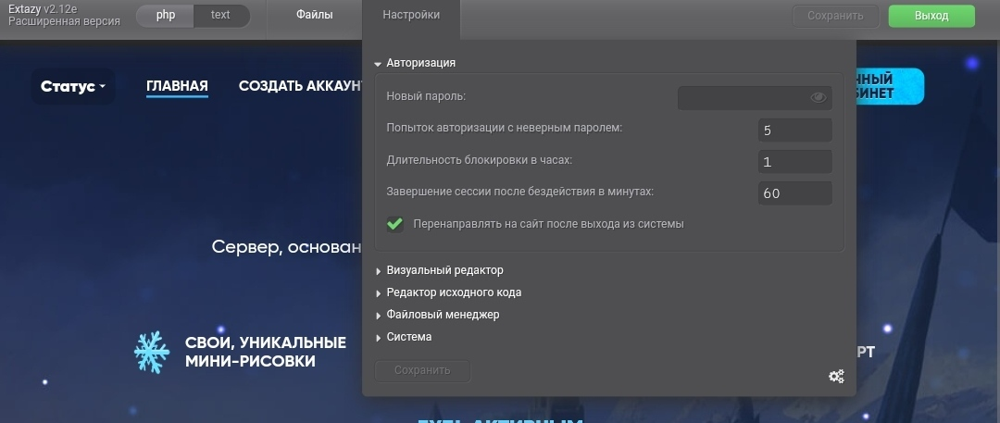
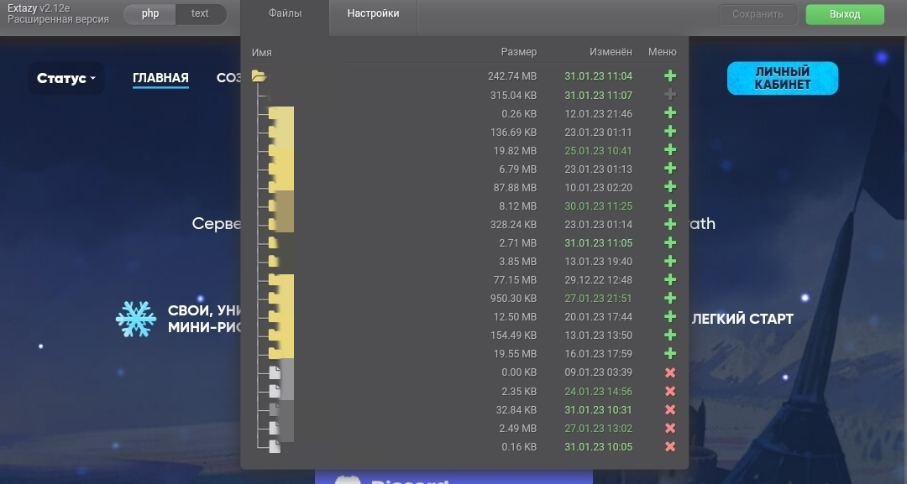
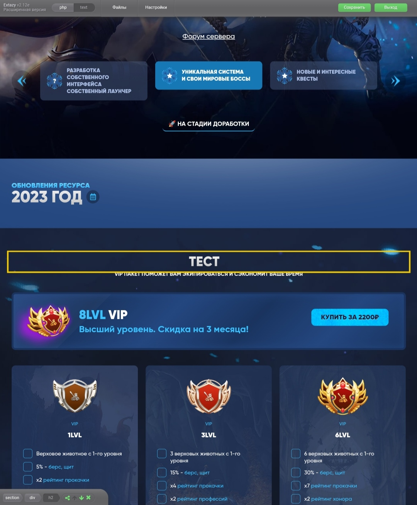

# web-admin RU
Создайте папку admin в корневой директории сайта и поместите туда файлы
  
Перейдите по адресу ваш_домен/admin
  
Введите пароль admin, далее его рекомендую сменить, функцию можно увидеть на первом скриншоте
  
Если ваш сайт использует язык <code>php</code>, то вам достаточно изменить строку <code>default_file = index.html</code> на <code>default_file = index.php</code> в файле <code>conf.ini</code>, ну или напрямую в админ панели, после авторизации.
  
# web-admin EN
Create the admin folder in the root directory of the site and put the files there
  
Go to your_domain/admin
  
Enter the admin password, then I recommend changing it, the function can be seen in the first screenshot
  
If your site uses the language <code>php</code>, then you just need to change the line <code>default_file = index.html </code> to <code>default_file = index.php </code> in the <code>conf.ini</code> file, or directly in the admin panel, after authorization.

<h3 align="center"></h3>

<h3 align="center"></h3>

<h3 align="center"></h3>
